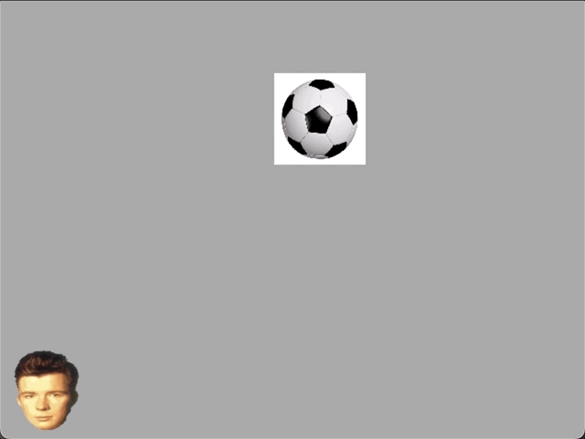

# CEGE

CEGE (C++ ECS Game Engine) is a game engine written in C++, based on an Entity Component System architecture.

## Foreword

CEGE was originally a personal project that happened to line up with my APCS class final project's timeline, so I decided to use a portion of its development as my final project. I had been working out the initial plans for it when the final project was announced, so this slice of development is from the first steps of coding.
I started CEGE to learn more about game engines, including graphics, windowing, physics, and other concepts that developers have invented and fine-tuned over several years. I also wanted to gain experience with working on a C++ project, instead of only writing small code snippets with it.

## Introduction

CEGE (C++ ECS Game Engine) is a game engine written in C++ that takes inspiration from other engines that use a design pattern known as an ECS (Entity Component System), such as Unity. CEGE is designed as a lightweight alternative to more feature-packed engines like Unity or Unreal Engine, where developers may not need every single feature. Instead, CEGE provides a minimal ECS system that's linked to a graphics library called SDL. Developers can code their game using a minimal library, while still utilizing convenience functions, classes, etc. and not having to worry about all the boilerplate SDL code or managing their own data.

## SDL

Simple DirectMedia Layer (SDL) is a library that provides cross-platform, low-level access to graphics, audio, and I/O. There are also extension libraries that provide image and audio file loading and manipulation, font processing, and networking. For the most part, developers working with CEGE don't have to worry about managing SDL. Most of the work is done for you. To set up and use SDL, an instance of `Context` should be created, passing in `WindowOptions` to configure the window. Using that object, a `Window` and your first `Scene` can be created:

```c++
#include <SDL.h>
#include <cege.hpp>

constexpr WindowOptions WINDOW_OPTIONS{
  "Hello, SDL!", // title
  SDL_WINDOWPOS_CENTERED, // x
  SDL_WINDOWPOS_CENTERED, // y
  640, // width
  480, // height
};

int main() {
  Context ctx{WINDOW_OPTIONS};
  auto &window = ctx.get_window();
  auto scene = ctx.create_scene();
}
```

## ECS

CEGE uses a design pattern called an Entity Component System to manage entities and associated data. Each instance of an ECS is handled by a `Scene`. Scenes act as an interface to an ECS and provide helper methods to the underlying `Entity`, `Component`, and `System` managers.
Entities represent a thing in the world, such as a table, a weapon, a human, an enemy, or any other item, creature, etc. In CEGE, entities are represented by a unique ID. An entity is essentially just a unique identifier, although in CEGE, the Entity class also contains helper member functions to make code more readable. Entities also have associated components, which are essentially just data. In CEGE, components are user-created structs (or less often, classes). Entities can create an instance of a component for their own use. For example, an entity that represents a character may have a Transform component that contains vectors that represent its position, rotation, and scale:

```c++
#include <SDL.h>
#include <cege.hpp>
#include <iostream>

struct Vector2 {
  float x, y;
};

struct Transform {
  Vector2 position;
  Vector2 scale{1.0f, 1.0f};
  float rotation;
};

int main() {
  /* Initialize context and create a scene */

  auto player = scene.create_entity();
  player.create_component<Transform>();

  // Components may also be created outside of the scene and moved in:
  // Transform player_transform{50.0f, 75.0f};
  // player.set_component<Transform>(std::move(player_transform));

  // Components can be retrieved using get_component<T>():
  auto &transform = player.get_component<Transform>()->get(); // ->get() is used to acquire the reference inside the std::optional<T>
  std::cout << transform.position.x << "\n"; // 50
  transform.position.y += 50.0f;
}
```

Systems are functions that act on entities that have specific components. To create a `System` in CEGE, create a class that inherits `System` publically:

```c++
class TestSystem : public System {
  public:
    auto run() -> void {
      std::cout << "Hello, world!\n";
    }
};
```

After defining a system, an instance of it can be created in a scene. Using `Scene::create_system` will create a managed instance of the system:

```c++
int main() {
  /* Initialize context and create a scene */

  auto &test_system = scene.create_system<TestSystem>();
  test_system.run();
}
```

The main feature of systems is signatures. Signatures represent a set of component types that a system cares about. Whenever a component is added to or removed from an entity, the scene will update all systems' internal `entities` member variable. `entities` is a list of entity IDs that contain at least all components that the system's signature has. Once a system's signature is set, `System::get_entities` can be used to get the entities that have the specified components:

```c++
struct Foo {
  const char *name;
};

struct Bar {
  const char *name;
};

class FooSystem : public System {
  public:
    auto print(Scene &scene) -> void {
      std::cout << "\nFooSystem:\n";

      for (auto &entity : get_entities(scene)) {
        auto &foo = entity.get_component<Foo>()->get();
        std::cout << foo.val << "\n";
      }
    }
};

class FooBarSystem : public System {
  public:
    auto sum(Scene &scene) -> void {
      std::cout << "\nFooBarSystem:\n";

      for (auto &entity : get_entities(scene)) {
        auto &foo = entity.get_component<Foo>()->get();
        auto &bar = entity.get_component<Bar>()->get();

        std::cout << foo.val << "\t" << bar.val << "\n";
      }
    }
}

int main() {
  /* Initialize context and create a scene */

  // The signature is created using all the types that follow the system:
  auto &foo_system = scene.create_system<FooSystem, Foo>(); // Signature: Foo
  auto &foo_bar_system = scene.create_system<FooBarSystem, Foo, Bar>(); // Signature: Foo | Bar

  // Arguments to Entity::create_compnonent will be passed to the component's constructor.
  auto foo1 = scene.create_entity();
  foo1.create_component<Foo>("foo1");
  auto foo2 = scene.create_entity();
  foo2.create_component<Foo>("foo2");
  auto foo3 = scene.create_entity();
  foo3.create_component<Foo>("foo3");

  auto bar1 = scene.create_entity();
  bar1.create_component<Bar>("bar1");
  auto bar2 = scene.create_entity();
  bar2.create_component<Bar>("bar2");

  auto foo_bar1 = scene.create_entity();
  foo_bar1.create_component<Foo>("Foo foo_bar1");
  foo_bar1.create_component<Bar>("Bar foo_bar1");
  auto foo_bar2 = scene.create_entity();
  foo_bar2.create_component<Foo>("Foo foo_bar2");
  foo_bar2.create_component<Bar>("Bar foo_bar2");

  // A system captures all entities that have all components of its signature, but they may have more.
  // For example, foo1-foo3 are captured, and so are foo_bar1 and foo_bar2, even though foo_bar1 and foo_bar2 have Bar components.
  // However, bar1 and bar2 are ignored, since they don't have a Foo component.
  foo_system.print(scene);
  /*
    foo1
    foo2
    foo3
    Foo foo_bar1
    Foo foo_bar2
  */

  // All components must be present, so if a system has a signature with multiple components, entities must have all of those components to be captured by the system.
  // foo_bar1 and foo_bar2 have both a Foo and Bar component, so they are captured by this system. All the other entities don't match the signature, so they are ignored.
  foo_bar_system.print(scene); // 30
  /*
    Foo foo_bar1    Bar foo_bar1
    Foo foo_bar2    Bar foo_bar2
  */
}
```

## Context

The `Context` class integrates the ECS part with SDL to allow systems to provide graphical output. `Context::get_window` can be used to get a reference to the `Window`, which can then be used to load images into `Texture`s, which can then be copied to the back buffer using `Window::render`. The main rendering loop should consist of a call to `Window::clear` to clear the back buffer, followed by any number of `Window::render` calls to populate the back buffer, then a call to `Window::present` to swap the buffers. Here's an example of this entire process:

```c++
constexpr auto WINDOW_WIDTH = 640;
constexpr auto WINDOW_HEIGHT = 480;

struct Transform {
  float x, y, w{1.0f}, h{1.0f};
};

class MoveSystem : public System {
  public:
    auto move(Scene &scene) -> void {
      for (auto &entity : get_entities(scene)) {
        auto &transform = entity.get_component<Transform>()->get();
        transform.x = (transform.x + 10.0f);
        if (transform.x > WINDOW_WIDTH)
          transform.x = 0.0f;
      }
    }
};

class RenderSystem : public System {
  public:
    auto render(Scene &scene, Window &window) -> void {
      window.clear(); // Clear the back buffer

      for (auto &entity : get_entities(scene)) {
        auto &texture = entity.get_component<Texture>()->get();
        auto &transform = entity.get_component<Transform>()->get();

        // Define where to render the texture
        // In SDL, the origin is at the top left, so we have to do some math to emulate having the origin at the bottom left.
        SDL_Rect dstrect{
          .x = static_cast<int>(transform.x),
          .y = static_cast<int>(WINDOW_HEIGHT - transform.y - transform.h),
          .w = static_cast<int>(transform.w),
          .h = static_cast<int>(transform.h),
        };

        window.render(
          texture,   // The texture to render
          nullptr,   // The rectangular area of the texture to use
          &dstrect,  // The destination to render to
        );
      }

      window.present(); // Swap the buffers
    }
};

int main() {
  // SDL
  constexpr WindowOptions WINDOW_OPTIONS{
    "Rendering time!",
    SDL_WINDOWPOS_CENTERED,
    SDL_WINDOWPOS_CENTERED,
    WINDOW_WIDTH,
    WINDOW_HEIGHT,
  };
  Context ctx{WINDOW_OPTIONS};
  auto &window = ctx.get_window();
  auto scene = ctx.create_scene();

  // Systems
  auto &render_system = scene.create_system<RenderSystem, Transform, Texture>();
  auto &move_system = scene.create_system<MoveSystem, Transform>();

  // Entities
  auto ball = scene.create_entity();
  ball.create_component<Transform>();
  ball.create_component<Texture>("assets/ball.jpg", window.get_renderer());

  // Simple main loop
  SDL_Event e;
  bool quit = false;

  while (quit == false) {
    // Handle events
    while (SDL_PollEvent(&e)) {
      if (e.type == SDL_QUIT) quit = true;
    }

    // Main loop code
    move_system.move(scene);
    render_system.render(scene, window);
  }
}
```

This code snippet is a very minimal example of what CEGE can be used to create. SDL can also handle I/O using events, which can allow for player control, shown in the demo.

## First Working Prototype

The demo in `src/` is a very simple prototype that features player input, collision detection, and simple physics.



All the code for this demo can be found in `src/`.

## APCS Conclusion

Overall, this project taught a lot about C++ and its intricacies (mainly with the standard library and C++20 features), how game engines work, and how an entity component system can be written.
